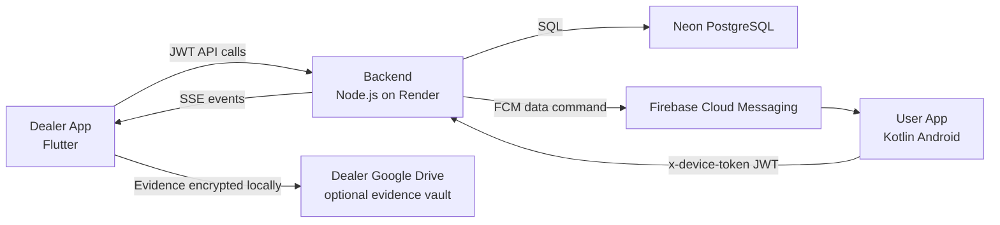
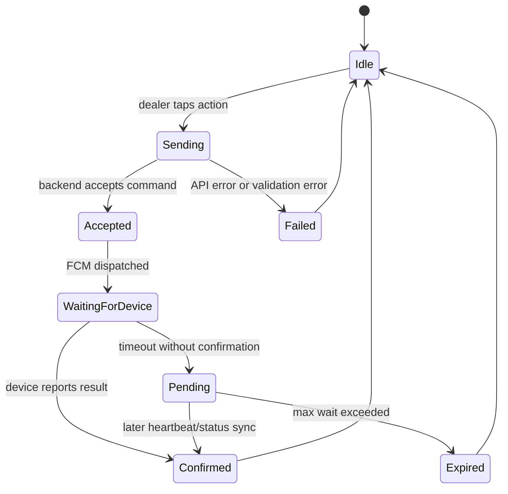
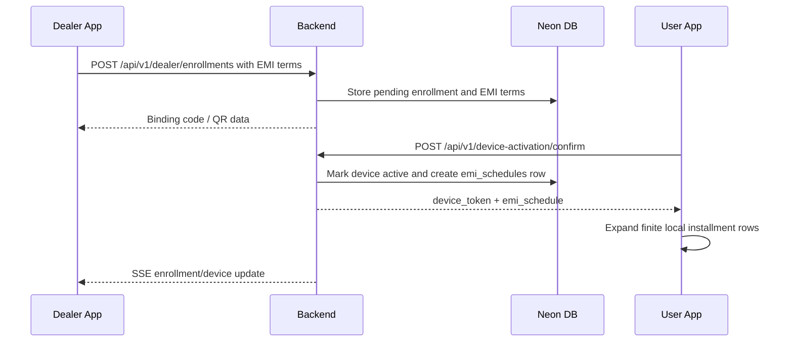
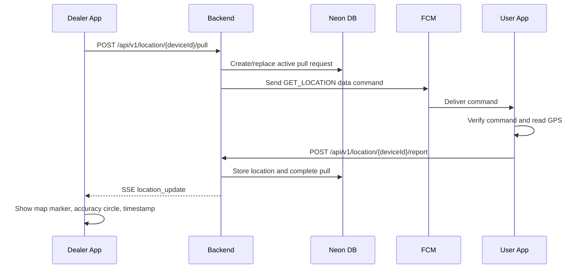
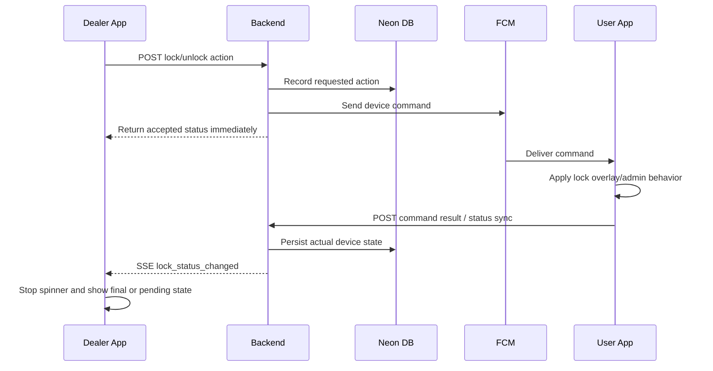
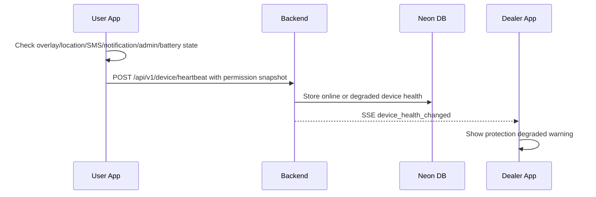
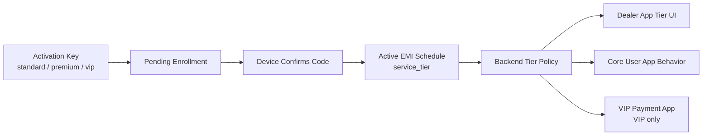

# EMI Locker System Map

This file is the living collaboration map for EMI Locker. Update it in the same change whenever backend routes, app flows, database tables, FCM commands, SSE events, or security assumptions change.

## Ownership Model

| Area | Primary owner | Responsibility |
| --- | --- | --- |
| Product decisions | Founder / product owner | Payment rules, lock policy, dealer workflow, release approval |
| System building | Codex + builder | Implementation, architecture hygiene, documentation updates |
| Backend maintenance | Backend developer | Render service, API contracts, Neon schema, FCM/SSE command flow |
| Dealer app maintenance | Flutter developer | Dealer UX, command screens, real-time status, evidence capture |
| User app maintenance | Kotlin developer | Device command receiver, permissions, lock overlay, heartbeat, offline OTP |
| QC / field testing | Tester | Real-device test runs, fault reporting, permission tamper checks |

## Source Of Truth Rule

A code change is not complete unless the matching documentation is updated:

| Change type | Required docs |
| --- | --- |
| New backend route or response shape | `docs/API_ROUTE_INDEX.md` |
| New device command or SSE event | `docs/SYSTEM_MAP.md`, route-specific flow doc |
| New database table or column | `docs/DATABASE_SCHEMA_MAP.md` |
| New service tier behavior | `docs/THREE_TIER_SERVICE_GUIDE.md` |
| New bug, false fix, or production issue | `docs/FAULT_LEDGER.md` |
| New manual test case | `docs/qc/EMI_LOCKER_QC_MATRIX.csv` and workbook |

## High-Level Architecture

## Command Lifecycle Contract

Every command must have a visible terminal state in the dealer UI.

Required UI behavior:

| State | Dealer UI behavior |
| --- | --- |
| Sending | Disable button, show short progress text |
| Accepted | Show "request sent" immediately |
| WaitingForDevice | Poll or listen to SSE with max wait |
| Confirmed | Show final status and refresh device detail |
| Pending | Stop spinner; show "device has not confirmed yet" |
| Failed | Show readable error and allow retry |

## Main Runtime Flows

### Enrollment And EMI Schedule

IMEI capture rule:

| Source | System behavior |
| --- | --- |
| Dealer scan | Dealer app scans QR/barcode from phone box or sticker, extracts up to two valid 15-digit IMEIs, and pre-fills IMEI 1 / IMEI 2 |
| Dealer manual input | Dealer can type IMEI manually as fallback; app validates 15 digits plus Luhn checksum |
| User app hardware read | Optional only; modern Android often blocks IMEI access for normal apps |
| Backend validation | Enrollment API rejects invalid IMEI checksums and duplicate IMEI 1 / IMEI 2 |

### Pull Location

### Lock / Unlock

### Permission Tamper Detection

The user app reports permission health on app start, dashboard resume, foreground service start, FCM command handling, and scheduled heartbeat. Android does not provide one universal instant permission-change broadcast, so the app reports the change at the first reliable runtime touchpoint after tampering.

## Codebase Index

| Codebase | Path | Role |
| --- | --- | --- |
| Backend | `backend/` | API, DB access, FCM dispatch, SSE, auth, enrollment, lock/location/message flows |
| Dealer app | `dealer-app-v2/` | Flutter app used by dealers/resellers/admin-like roles |
| User app | `user-app/` | Kotlin Android collateral phone agent |
| Admin panel | `admin-panel/` | Web admin operations |
| Database docs/migrations | `database/`, `backend/src`, `backend/scripts` | Schema and migration history |
| Collaboration docs | `docs/` | Living maps, fault ledger, QC workbook |

## Service Tier Contract

The Normal / Premium / VIP business behavior is defined in `docs/THREE_TIER_SERVICE_GUIDE.md`.

Do not treat key tier as only a UI label. During confirmed enrollment, key/enrollment tier must become runtime service policy for backend scheduler, dealer UI, user app behavior, and future VIP payment app behavior.

## Known Architecture Risks

| Risk | Why it matters | Guardrail |
| --- | --- | --- |
| Dealer monolith file | Too many flows in one file hides bugs | Split by feature after critical timeouts/logging |
| Silent catches | Errors disappear and UI spins | No `catch (_) {}` without logging |
| No command ceiling | UI can wait forever | Every action has timeout and pending state |
| Permission tampering | User app can become ineffective | User app must detect missing permissions and report degraded status |
| Stale location | Dealer may think old data is live | Every location must show freshness and timestamp |
| Offline device | Commands cannot complete instantly | Dealer UI must distinguish accepted, pending, confirmed |
